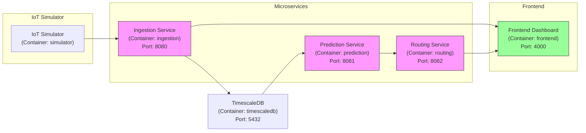

# CityFlow Analytics - Architecture

## Vue d'ensemble

CityFlow Analytics est un système IoT pour **la collecte et l'analyse du trafic urbain en temps réel**.  
Le projet est organisé en microservices et un frontend, orchestrés via Docker (et plus tard Kubernetes).

### Composants principaux

| Composant | Langage / Tech | Port | Description |
| - | -- | - | - |
| Ingestion | Go | 8080 | Reçoit les données de trafic simulées, log minimal pour test |
| Prediction | Go | 8081 | Service de prédiction du trafic à 30 min |
| Routing | Go | 8082 | Service de reroutage intelligent pour éviter embouteillages |
| Frontend | Node.js / Express | 4000 | Dashboard temps réel, reçoit flux WebSocket |
| IoT Simulator | Node.js | N/A | Génère des données de trafic simulées pour tests locaux |
| TimescaleDB | Postgres/Timescale | 5432 | Base séries temporelles pour stockage des données trafic |

---

## Flux de données

```mermaid
flowchart TD
    IoT_Node["IoT Simulator"] --> Ingest["Ingestion Service (Go)"]
    Ingest --> DB_Node["TimescaleDB (Séries temporelles)"]
    Ingest --> Frontend["Frontend Dashboard (Node.js)"]
    DB_Node --> Predict["Prediction Service (Go)"]
    Predict --> Routing["Routing Service (Go)"]
    Routing --> Frontend

    classDef service fill:#f9f,stroke:#333,stroke-width:1px;
    class Ingest,Predict,Routing service;
````

* **Simulateur IoT** : envoie chaque seconde un JSON simulant un capteur de trafic
* **Ingestion** : reçoit les données, les log et les prépare pour la DB
* **Prediction** : analyse les données historiques pour prédire le trafic
* **Routing** : génère des reroutages optimisés
* **Frontend** : affiche les données en temps réel sur le dashboard

## Communication

* **Frontend ↔ Ingestion** : via WebSocket
* **Simulator ↔ Ingestion** : via HTTP POST (ou MQTT plus tard)
* **Ingestion ↔ DB** : insertions dans TimescaleDB
* **Prediction / Routing ↔ DB** : lecture des données et écriture prédictions
* Tous les services sont containerisés et communiquent via Docker network (localhost pour dev)

## Docker / Ports

| Service     | Dockerfile                         | Port exposé          |
| ----------- | ---------------------------------- | -------------------- |
| Ingestion   | src/services/ingestion/Dockerfile  | 8080                 |
| Prediction  | src/services/prediction/Dockerfile | 8081                 |
| Routing     | src/services/routing/Dockerfile    | 8082                 |
| Frontend    | src/frontend/Dockerfile            | 4000                 |
| Simulator   | src/iot-simulator/Dockerfile       | N/A (logs seulement) |
| TimescaleDB | -                                  | 5432                 |

* **docker-compose.yml** permet de lancer tous les services en local.
* Les ports sont configurés pour éviter les conflits avec Grafana (3000).

## Notes

* Cette architecture est **modulaire**, chaque microservice peut être développé/testé indépendamment.
* Les ports et la communication seront adaptés lors du passage à Kubernetes (K3s + Istio).
* Le CI GitHub Actions teste uniquement la **validité des builds Docker** pour chaque service.

## Schéma d'architecture (microservices)

```mermaid
flowchart LR
    subgraph SG_IoT ["IoT Devices"]
        IoT_Node["IoT Simulator"]
    end

    subgraph SG_Microservices ["Microservices"]
        Ingest["Ingestion Service - Port 8080"]
        Predict["Prediction Service - Port 8081"]
        Routing["Routing Service - Port 8082"]
    end

    subgraph SG_Frontend ["Frontend"]
        Frontend["Frontend Dashboard - Port 4000"]
    end

    DB_Node["TimescaleDB"]

    IoT_Node --> Ingest
    Ingest --> DB_Node
    Ingest --> Frontend
    DB_Node --> Predict
    Predict --> Routing
    Routing --> Frontend

    classDef service fill:#f9f,stroke:#333,stroke-width:1px;
    class Ingest,Predict,Routing service;
```

## Diagramme Docker Compose (containers + ports exposés)

