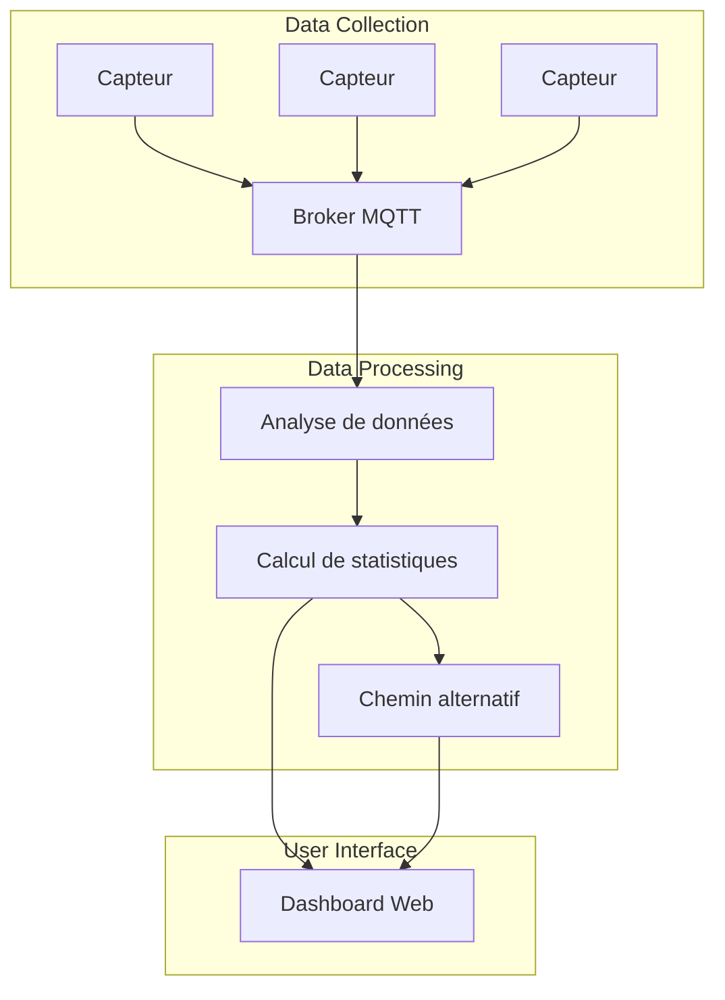
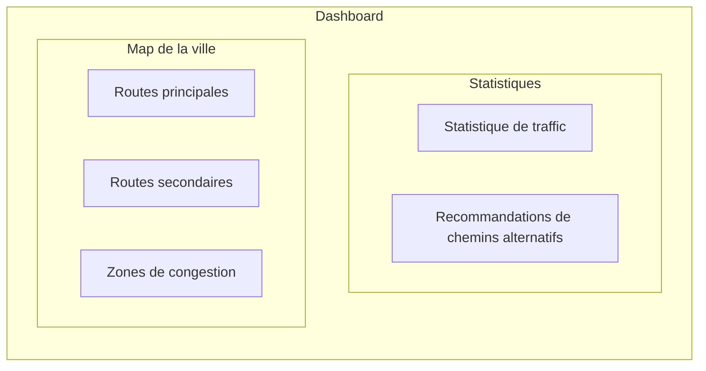

# Project Architecture

## System Design

Le systeme de surveillance et de gestion du traffic urbain est conçu pour collecter des données en temps réel à partir de capteurs installés dans la ville, analyser ces données pour calculer des statistiques de traffic, et proposer des chemins alternatifs aux utilisateurs.

## Dashboard Mockup

Map de la ville avec les routes principales, les routes secondaires et les zones de congestion. Les routes sont colorées en fonction du niveau de traffic (vert pour fluide, jaune pour modéré, rouge pour congestionné). Un panneau latéral affiche les statistiques de traffic en temps réel et les recommandations de chemins alternatifs.

